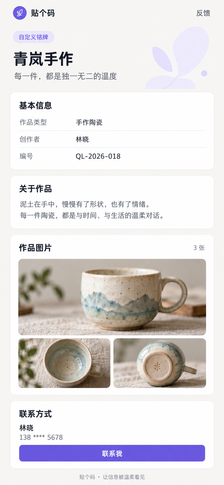
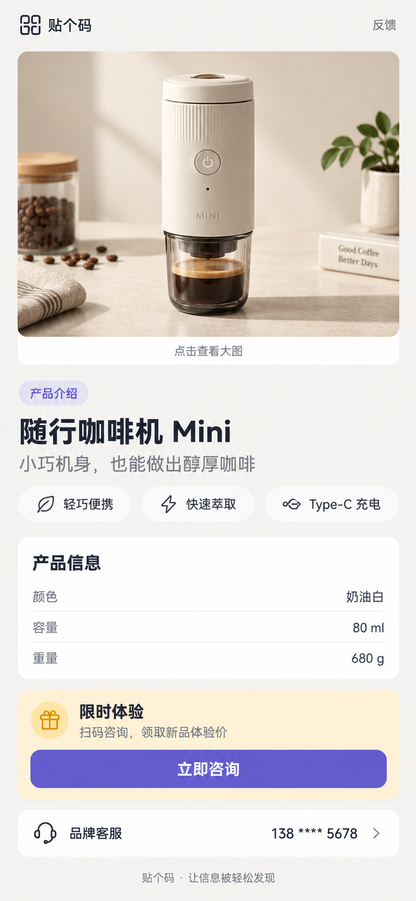
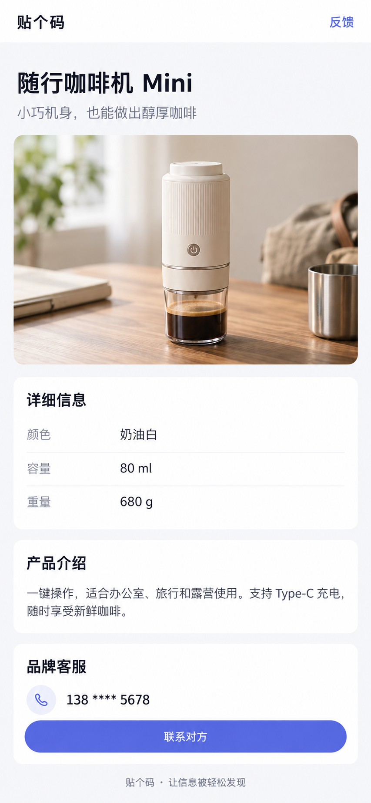

# 自定义铭牌详情页 V2 设计方案

## 设计结论

取消顶部轮播和图片文字叠加，但不固定成“作品展示”模板。页面根据用户实际填写的内容组合模块：图片可以优先，也可以位于文字之后；标题、副标题始终落在独立背景上，从结构上杜绝文字与图片重叠。

## 内容自适应规则

- 只有一张图片：使用单张大图，不显示张数、缩略图或轮播控件。
- 多张图片：首图大图，其余图使用缩略图，点击后统一进入图片预览。
- 产品宣传：顺序为产品图、标题与卖点、产品信息、推广行动、联系方式。
- 个人或作品介绍：顺序为标题与简介、基本信息、正文、图片、联系方式。
- 只有图片和标题：只保留品牌栏、单图、标题和页脚，避免空卡片。
- 未填写的模块整体隐藏，不显示“暂无内容”等占位信息。
- 栏目标题采用中性或用户配置的文案，不固定使用“作品”“创作者”等语义。

## 与当前表单字段的对应关系

本方案不增加产品分类、卖点、价格、活动、按钮文案等字段，只消费当前已经存在的数据。

| 当前表单字段 | 详情页呈现 |
| --- | --- |
| 铭牌名称 `subjectName` | 页面主标题 |
| 扫码提示语 `customTagline` | 主标题下方副标题 |
| 相关图片 `images` | 1 张为独立大图；2–6 张为画廊 |
| 信息项 `customInfoItems` | 统一放入“详细信息”键值列表，并保持用户排序 |
| 文字说明 `customTextSections` | 每段独立成卡片，小标题和正文均使用用户输入 |
| 联系人 `ownerName` | 联系卡片标题 |
| 联系电话 `phone` | 脱敏号码和固定“联系对方”操作 |

除“详细信息”和“联系对方”外，不增加带业务倾向的系统文案。未填写的可选字段对应模块整体隐藏。

## 通用信息层级

1. 品牌栏：贴个码、反馈
2. 身份区：类型标签、铭牌名称、一句话说明
3. 基本信息：用户配置的键值信息
4. 文字内容：按用户设置的章节顺序展示
5. 图片内容：单图时只展示大图，多图时才展示缩略图
6. 联系方式：联系人、脱敏号码、主要操作按钮
7. 品牌页脚

## 视觉规范

- 页面背景：`#F6F5F2`
- 卡片背景：`#FFFFFF`
- 主文字：`#20232A`
- 次文字：`#7B7F89`
- 品牌强调色：`#6759D6`
- 浅强调底色：`#EFECFF`
- 卡片圆角：16–20px
- 页面左右边距：18px
- 模块间距：12–16px
- 标题区与图片完全分离，不使用图片蒙层承载文字

## 交互说明

- 图片少于 1 张时不展示图库模块。
- 1 张图片时使用单张 4:3 大图；2 张及以上时首图大图，其余图以双列缩略图展示。
- 点击任意图片进入全屏预览，可左右浏览全部图片。
- 联系电话仍只展示脱敏号码，点击“联系我”后调用现有联系逻辑。
- “反馈”固定在顶部品牌栏右侧，不覆盖任何内容。

## 设计稿 A：个人或内容介绍

## 设计稿 B：单图产品宣传

> 该稿用于探索产品宣传表达，其中卖点和促销模块超出了当前表单字段，不作为实现依据。

## 设计稿 C：严格兼容当前表单的通用单图页（推荐）

